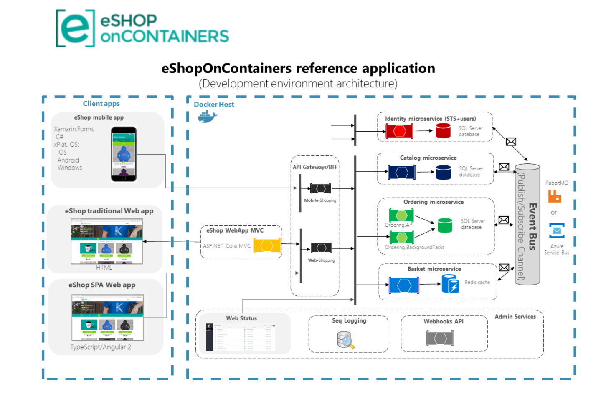

# 微服务

## 1. 什么是微服务？

微服务架构（通常简称为微服务）是指开发应用所用的一种`架构形式`。

通过微服务，可将大型应用分解成多个独立的组件，其中每个组件都有各自的责任领域。在处理一个用户请求时，基于微服务的应用可能会调用许多内部微服务来共同生成其响应。

* 多个独立的组件，指的就是微服务
* 独立服务一般有明确定义的API，用于通信
* 独立服务通常由一个小型团队负责
* 针对每个独立服务的开发，部署，运营维护，扩展等都不应该影响其他服务
* 每个服务应该针对一组功能进行设计，专注于解决特定的问题
* 每个服务不强调使用同一语言，这种称之为技术自由

> 容器是微服务架构的绝佳示例，现代云原生应用使用容器来构建微服务

架构图来源：https://github.com/dotnet-architecture/eShopOnContainers

微服务化后，虽然带来了诸多好处，比如弹性，敏捷，灵活扩展，易于部署，可重用代码等。

但是其同时也带来了复杂性，让整个架构变的不易于维护，所以诞生出来很多组件用于辅助，这些组件同样也成为了微服务架构中的一员，比如：

* 服务网关：确保服务提供者对客户端的透明，这一层可以进行反向路由、安全认证、灰度发布、日志监控等前置动作
* 服务发现：注册并维护远程服务及服务提供者的地址，供服务消费者发现和调用，为保证可用性，比如etcd，nacos，consul等
* 服务框架：用于实现微服务的 RPC 框架，包含服务接口描述及实现方案、向注册中心发布服务等功能，比如grpc，Thrift等
* 服务监控：对服务消费者与提供者之间的调用情况进行监控和数据展示，比如prometheus等
* 服务追踪：记录对每个请求的微服务调用完整链路，以便进行问题定位和故障分析，比如jeager，zipkin等
* 服务治理：服务治理就是通过一系列的手段来保证在各种意外情况下，服务调用仍然能够正常进行，这些手段包括熔断、隔离、限流、降级、负载均衡等。比如Sentinel，Istio等
* 基础设施：用以提供服务底层的基础数据服务，比如分布式消息队列、日志存储、数据库、缓存、文件服务器、搜索集群等。比如Kafka，Mysql，PostgreSQL，MongoDB，Redis，Minio，ElasticSearch等
* 分布式配置中心：统一配置，比如nacos，consul，apollo等
* 分布式事务：seata，dtm等
* 容器以及容器编排：docker，k8s等
* 定时任务

## 2. go微服务实践

在微服务领域，Java语言有很好的实践，就是Spring Cloud。

虽然有了Java的成功，但Go语言有自己的看法，所以诞生了很多种不同的实践方式。

这里有个前提：

> Go天然适配云原生，而云原生时代已经到来，各个应用组件基础设施等都应该积极的去拥抱云原生

### 2.1 标准库/自研派系

得益于go标准库的性能，稳定性，很多团队基于标准库来灵活的搭建微服务程序。

这个思想来自于一个认知：`不要让框架束缚开发`。

而go标准库的强大，能让开发者做到这一点，即使不使用框架，也能开发出高效的应用程序。

微服务的基础是通信，也就是RPC框架的选择，这一点上，大部分会选择grpc或者基于grpc的基础上进行自研rpc框架的研发。

至于其他用到的组件，有需要的时候，进行集成就可以了。

如果部署采用k8s，并且使用服务网格，比如Istio来处理，那么你只需要关心业务逻辑就可以，不需要在关心服务发现，熔断，流量控制，负载均衡等

### 2.2 web框架派系

这个派系依旧秉承`不要让框架束缚开发`，但由于从标准库到可使用的web框架，仍旧需要一定量的开发工作，所以倾向于选择成熟的go web框架，比如gin。

所以出现了以`gin+grpc`为核心，将其他组件集成进来的微服务架构。

同样可以使用k8s+istio。

最终构建的仍旧是现代化的云原生微服务架构。

### 2.3 大一统框架

当然，并不是所有的团队都有能力去执行上述两种方式，因为go开发者大多数是从别的语言转过来的，而其他语言都有成熟的大一统框架进行支撑，那自然而然，希望go也有这样的框架。

虽然我个人也并不赞成这样的方式，但也有其优点，因为能很好的减轻工作量，达到快速开发的目的，代价就是遵循框架的规则。

go主打微服务的框架并不算太多，go-zero就是其中一个。

这个框架国人开发，文档齐全，国内使用人数多且加上社区活跃，如果非要选择，那么go-zero是一个不错的选择。