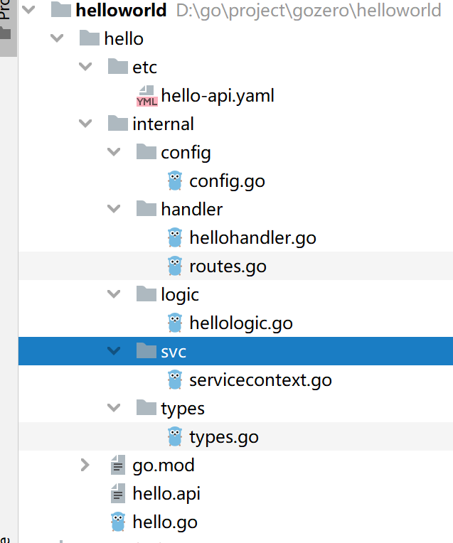

# 入门

## 1. 环境准备

* go版本：

~~~powershell
C:\Users\Huo>go version
go version go1.20.1 windows/amd64
~~~

* goctl安装：

  goctl（官方建议读go control）是go-zero微服务框架下的代码生成工具。使用 goctl 可显著提升开发效率，让开发人员将时间重点放在业务开发上，其功能有：

  - api服务生成
  - rpc服务生成
  - model代码生成
  - 模板管理

  ~~~go
  go install github.com/zeromicro/go-zero/tools/goctl@v1.4.4
  ~~~

  这时候会在gopath的bin目录下生成goctl的执行进程（注意要将%GOPATH%\bin设置到path环境变量中）。

  ~~~powershell
  C:\Users\Huo>goctl -version
  goctl version 1.4.4 windows/amd64
  ~~~

* protoc & protoc-gen-go安装

  go-zero提供了便捷的安装方式：

  ~~~powershell
  goctl env check -i -f --verbose
  ~~~

IDE工具我这里选择的是Goland，原因是我喜欢用Jetbrains的全家桶。

大家也可以使用广受好评的VS Code，免费的IDE，非常强大。

## 2.HelloWorld

接下来我们就写一个经典的Hello World程序进行一个简单的入门。

~~~powershell
D:\go\project\gozero>mkdir helloworld
D:\go\project\gozero>cd helloworld
D:\go\project\gozero\helloworld>goctl api new hello
D:\go\project\gozero\helloworld>cd hello
D:\go\project\gozero\helloworld\hello>go mod tidy
~~~

使用goland打开，编写程序。

我们改一下路由，将自动生成的`form/:name` 改为`hello`

~~~go
func RegisterHandlers(server *rest.Server, serverCtx *svc.ServiceContext) {
	server.AddRoutes(
		[]rest.Route{
			{
				Method:  http.MethodGet,
				Path:    "/hello",
				Handler: HelloHandler(serverCtx),
			},
		},
	)
}
~~~

~~~go
type Request struct {
	//Name string `path:"name,options=you|me"`
}
~~~

 ~~~go
 func (l *HelloLogic) Hello(req *types.Request) (resp *types.Response, err error) {
 	// todo: add your logic here and delete this line
 	resp = &types.Response{
 		Message: "Hello go-zero",
 	}
 	return
 }
 
 ~~~

启动程序，访问`http://localhost:8888/hello`

~~~json
// http://localhost:8888/hello

{
  "message": "Hello go-zero"
}
~~~

ok，入门了~

## 3. 微服务版HelloWorld

场景：

假设有两个服务：

* order service
* user service

用户在查询订单时，同时需要获取用户信息。

~~~powershell
D:\go\project\gozero>cd microhelloworld
D:\go\project\gozero\microhelloworld>mkdir mall
D:\go\project\gozero\microhelloworld>cd mall
D:\go\project\gozero\microhelloworld\mall>goctl api new order
D:\go\project\gozero\microhelloworld\mall>goctl api new user
D:\go\project\gozero\microhelloworld\mall>go work init
D:\go\project\gozero\microhelloworld\mall>go work use order
D:\go\project\gozero\microhelloworld\mall>go work use user
~~~

我们先在user模块提供一个api，用于order调用。

user/rpc/user.proto

~~~protobuf
syntax = "proto3";

package user;

// protoc-gen-go 版本大于1.4.0, proto文件需要加上go_package,否则无法生成
option go_package = "./user";

message IdRequest {
  string id = 1;
}

message UserResponse {
  // 用户id
  string id = 1;
  // 用户名称
  string name = 2;
  // 用户性别
  string gender = 3;
}

service User {
  rpc getUser(IdRequest) returns(UserResponse);
}
~~~

前面我们讲过，服务和服务之间一般使用rpc通信，最常使用的就是grpc，接下来就是使用之前安装的protoc-gen-go将上述的proto文件生成go代码。

这里我们使用的go-zero框架，仍旧是go-zero的方式：

~~~powershell
D:\go\project\gozero\microhelloworld\mall\user\rpc> goctl rpc protoc user.proto --go_out=./types --go-grpc_out=./types --zrpc_out=.
~~~

~~~powershell
D:\go\project\gozero\microhelloworld\mall\user\rpc> cd ..
D:\go\project\gozero\microhelloworld\mall\user> go mod tidy
~~~

在logic中填充业务逻辑：

~~~go
func (l *GetUserLogic) GetUser(in *user.IdRequest) (*user.UserResponse, error) {
	// todo: add your logic here and delete this line

	return &user.UserResponse{
		Id:   "1",
		Name: "test",
	}, nil
}
~~~

接下来在order模块，写一个接口，获取订单信息，其中订单信息中需要携带用户信息。

编写order.api

~~~go
type Request {
	Name string `path:"name,options=you|me"`
}

type Response {
	Message string `json:"message"`
}

type(
	OrderReq {
		Id string `path:"id"`
	}

	OrderReply {
		Id string `json:"id"`
		Name string `json:"name"`
		UserName string `json:"userName"`
	}
)

service order-api {
	@handler OrderHandler
	get /from/:name(Request) returns (Response)
	@handler GetOrder
    get /api/order/get/:id (OrderReq) returns (OrderReply)
}
~~~

生成order服务

~~~powershell
goctl api go -api order.api -dir ./gen
~~~

添加user rpc配置:

~~~go
type Config struct {
    rest.RestConf
    UserRpc zrpc.RpcClientConf
}
~~~

在order-api.yaml

~~~yaml
Name: order-api
Host: 0.0.0.0
Port: 8888
UserRpc:
  Etcd:
    Hosts:
      - 127.0.0.1:2379
    Key: user.rpc
~~~

创建对user服务的rpc调用

~~~go
package svc

import (
	"github.com/zeromicro/go-zero/zrpc"
	"order/internal/config"
	"user/userclient"
)

type ServiceContext struct {
	Config  config.Config
	UserRpc userclient.User
}

func NewServiceContext(c config.Config) *ServiceContext {
	return &ServiceContext{
		Config:  c,
		UserRpc: userclient.NewUser(zrpc.MustNewClient(c.UserRpc)),
	}
}

~~~

编写逻辑

~~~go
package logic

import (
	"context"
	"errors"
	"order/internal/types"
	"user/types/user"

	"github.com/zeromicro/go-zero/core/logx"
	"order/internal/svc"
)

type GetOrderLogic struct {
	logx.Logger
	ctx    context.Context
	svcCtx *svc.ServiceContext
}

func NewGetOrderLogic(ctx context.Context, svcCtx *svc.ServiceContext) *GetOrderLogic {
	return &GetOrderLogic{
		Logger: logx.WithContext(ctx),
		ctx:    ctx,
		svcCtx: svcCtx,
	}
}

func (l *GetOrderLogic) GetOrder(req *types.OrderReq) (resp *types.OrderReply, err error) {
	// todo: add your logic here and delete this line
	userId := l.getOrderById(req.Id)
	uResp, err := l.svcCtx.UserRpc.GetUser(context.Background(), &user.IdRequest{
		Id: userId,
	})
	if err != nil {
		return nil, err
	}
	if uResp.Name != "test" {
		return nil, errors.New("用户不存在")
	}
	return &types.OrderReply{
		Id:       req.Id,
		UserName: uResp.Name,
		Name:     "test order",
	}, nil
}

func (l *GetOrderLogic) getOrderById(id string) string {
	return "1"
}

~~~

由于依赖etcd，所以需要启动一个etcd

我们使用docker启动

在mall目录下编写docker-compose.yml

~~~yaml
version: '3'
services:
  Etcd:
    container_name: etcd3
    image: bitnami/etcd:${ETCD_VERSION}
    deploy:
      replicas: 1
      restart_policy:
        condition: on-failure
    environment:
      - ALLOW_NONE_AUTHENTICATION=yes
    privileged: true
    volumes:
      - ${ETCD_DIR}/data:/bitnami/etcd/data
    ports:
      - ${ETCD_PORT}:2379
      - 2380:2380
~~~

同目录下创建.env

~~~shell
COMPOSE_PROJECT_NAME=gozero-demo-mall
ETCD_DIR=D:/go/project/gozero/etcd
ETCD_VERSION=3.5.6
ETCD_PORT=2379
~~~

~~~shell
docker-compose up -d
~~~

分别启动user服务和order服务。

~~~json
// http://localhost:8888/api/order/get/1

{
  "id": "1",
  "name": "test order",
  "userName": "test"
}
~~~

成功~

> 恭喜你，入门了~~