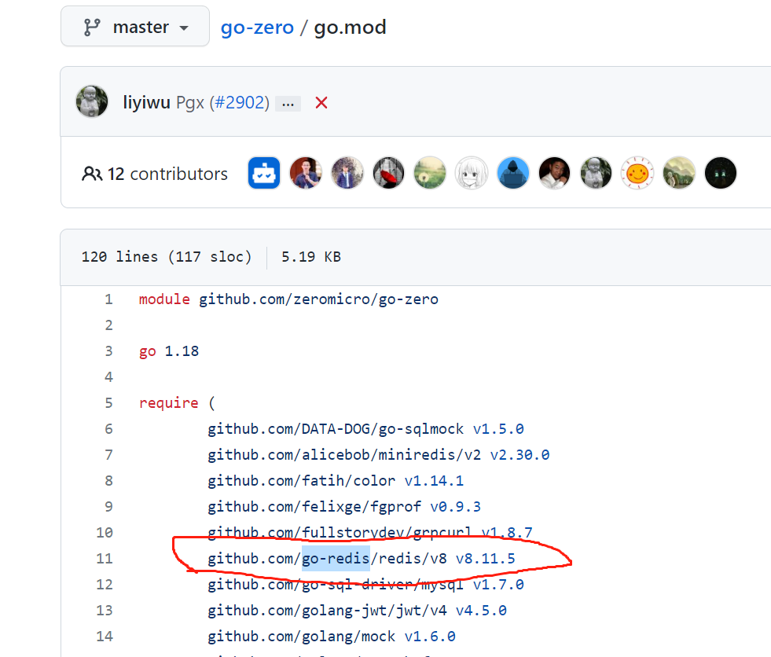

# 存储

## 1. Mysql

之前的入门案例中，我们没有去连接数据库，接下来我们将数据库连上，并进行操作。

准备数据库：

docker-compose.yml

~~~yaml
version: '3'
services:
  mysql:
    container_name: mysql8
    image: mysql:${MYSQL_VERSION}
    restart: always
    ports:
      - ${MYSQL_PORT}:3306
    environment:
      TZ: Asia/Shanghai
      MYSQL_ROOT_PASSWORD: root
      MYSQL_DATABASE: zero_mall
    volumes:
      - ${MYSQL_DIR}/data:/var/lib/mysql
      - ${MYSQL_DIR}/conf:/etc/mysql/conf.d/
      - ${MYSQL_DIR}/logs:/logs
    command:
      --default-authentication-plugin=mysql_native_password
      --character-set-server=utf8mb4
      --collation-server=utf8mb4_general_ci
      --explicit_defaults_for_timestamp=true
      --lower_case_table_names=1
  Etcd:
    container_name: etcd3
    image: bitnami/etcd:${ETCD_VERSION}
    deploy:
      replicas: 1
      restart_policy:
        condition: on-failure
    environment:
      - ALLOW_NONE_AUTHENTICATION=yes
    privileged: true
    volumes:
      - ${ETCD_DIR}/data:/bitnami/etcd/data
    ports:
      - ${ETCD_PORT}:2379
      - 2380:2380
~~~

.env:

~~~shell
COMPOSE_PROJECT_NAME=gozero-demo-mall
ETCD_DIR=D:/go/project/gozero/etcd
ETCD_VERSION=3.5.6
ETCD_PORT=2379
MYSQL_VERSION=8.0.20
MYSQL_DIR=D:/go/project/gozero/mysql
MYSQL_PORT=3309
~~~

创建表：

~~~sql
CREATE TABLE `user`  (
  `id` bigint(0) NOT NULL AUTO_INCREMENT,
  `name` varchar(255) CHARACTER SET utf8mb4 COLLATE utf8mb4_general_ci NOT NULL,
  `gender` varchar(255) CHARACTER SET utf8mb4 COLLATE utf8mb4_general_ci NOT NULL,
  PRIMARY KEY (`id`) USING BTREE
) ENGINE = InnoDB CHARACTER SET = utf8mb4 COLLATE = utf8mb4_general_ci ROW_FORMAT = Dynamic;
~~~

### 1.1 添加配置

~~~go
type Config struct {
	zrpc.RpcServerConf
	Mysql MysqlConfig
}

type MysqlConfig struct {
	DataSource string
}
~~~

~~~yaml
Name: user.rpc
ListenOn: 127.0.0.1:8080
Etcd:
  Hosts:
  - 127.0.0.1:2379
  Key: user.rpc
Mysql:
  DataSource: root:root@tcp(127.0.0.1:3309)/zero_mall?charset=utf8mb4&parseTime=true&loc=Asia%2FShanghai
~~~

### 1.2 实现

创建连接：

~~~go
package database

import "github.com/zeromicro/go-zero/core/stores/sqlx"

type DBConn struct {
	Conn sqlx.SqlConn
}

func Connect(dataSource string) *DBConn {
	sqlConn := sqlx.NewMysql(dataSource)
	return &DBConn{
		Conn: sqlConn,
	}
}

~~~

实现sql：

~~~go
package dao

import (
	"context"
	"fmt"
	"user/database"
	"user/internal/model"
)

type UserDao struct {
	*database.DBConn
}

func NewUserDao(conn *database.DBConn) *UserDao {
	return &UserDao{conn}
}

func (d *UserDao) Save(ctx context.Context, data *model.User) error {
	sql := fmt.Sprintf("insert into %s (name,gender) values (?,?)", data.TableName())
	result, err := d.Conn.ExecCtx(ctx, sql, data.Name, data.Gender)
	if err != nil {
		return err
	}
	id, err := result.LastInsertId()
	if err != nil {
		return err
	}
	data.Id = id
	return nil
}

~~~

调用

~~~go
func (l *GetUserLogic) SaveUser(in *user.UserRequest) (*user.UserResponse, error) {
	// todo: add your logic here and delete this line
	data := &model.User{
		Name:   in.GetName(),
		Gender: in.GetGender(),
	}
	err := l.svcCtx.UserRepo.Save(context.Background(), data)
	if err != nil {
		return nil, err
	}
	return &user.UserResponse{
		Id:     strconv.FormatInt(data.Id, 10),
		Name:   data.Name,
		Gender: data.Gender,
	}, nil
}
~~~

测试即可

## 2. Redis

go-zero框架使用的是go-redis

在这里，我们演示go-zero给我们提供的数据库缓存机制。

### 2.1 添加配置

~~~go
type Config struct {
	zrpc.RpcServerConf
	Mysql      MysqlConfig
	CacheRedis cache.CacheConf
}
~~~

~~~yaml
CacheRedis:
  - Host: 127.0.0.1:6379
    Type: node
~~~

docker-compose.yml:

~~~yaml
  Redis:
    container_name: redis6
    image: redis:${REDIS_VERSION}
    restart: always
    volumes:
      - ${REDIS_DIR}/data:/data
      - ${REDIS_DIR}/conf/redis.conf:/etc/redis/redis.conf
    ports:
      - ${REDIS_PORT}:6379
    command: redis-server /etc/redis/redis.conf
~~~

.env:

~~~shell
REDIS_VERSION=6.2.7
REDIS_PORT=6379
REDIS_DIR=D:/go/project/gozero/redis
~~~

redis.conf:

~~~shell
# 任意ip可访问
bind 0.0.0.0
# 自定义启动端口
port 6379
# rdb或aof文件存储位置
dir /data
save 900 1
save 300 10
save 60 10000
appendonly yes
appendfilename "appendonly.aof"
~~~

### 2.2 实现

~~~go
package database

import (
	"github.com/zeromicro/go-zero/core/stores/cache"
	"github.com/zeromicro/go-zero/core/stores/sqlc"
	"github.com/zeromicro/go-zero/core/stores/sqlx"
)

type DBConn struct {
	Conn      sqlx.SqlConn
	ConnCache sqlc.CachedConn
}

func Connect(dataSource string, conf cache.CacheConf) *DBConn {
	sqlConn := sqlx.NewMysql(dataSource)
	d := &DBConn{
		Conn: sqlConn,
	}
	if conf != nil {
		cachedConn := sqlc.NewConn(sqlConn, conf)
		d.ConnCache = cachedConn
	}
	return d
}

~~~

~~~go

func (d *UserDao) FindById(ctx context.Context, id int64) (user *model.User, err error) {
	user = &model.User{}
	query := fmt.Sprintf("select * from %s where id = ?", user.TableName())
	userIdKey := fmt.Sprintf("%s:%d", cacheUserIdPrefix, id)
	err = d.ConnCache.QueryRowCtx(ctx, user, userIdKey, func(ctx context.Context, conn sqlx.SqlConn, v interface{}) error {
		return conn.QueryRowCtx(ctx, v, query, id)
	})
	return
}

~~~

~~~go

func (l *GetUserLogic) GetUser(in *user.IdRequest) (*user.UserResponse, error) {
	// todo: add your logic here and delete this line
	id, _ := strconv.ParseInt(in.Id, 10, 64)
	userData, err := l.svcCtx.UserRepo.FindById(context.Background(), id)
	if err != nil {
		return nil, err
	}
	return &user.UserResponse{
		Id:     in.GetId(),
		Name:   userData.Name,
		Gender: userData.Gender,
	}, nil
}

~~~

api:

~~~go
func (h *UserHandler) GetUser(w http.ResponseWriter, r *http.Request) {
	var req types.IdRequest
	if err := httpx.ParsePath(r, &req); err != nil {
		httpx.ErrorCtx(r.Context(), w, err)
		return
	}
	l := logic.NewUserLogic(r.Context(), h.svcCtx)
	resp, err := l.GetUser(&req)
	if err != nil {
		httpx.ErrorCtx(r.Context(), w, err)
	} else {
		httpx.OkJsonCtx(r.Context(), w, resp)
	}
}
~~~

~~~go
{
				Method:  http.MethodGet,
				Path:    "/user/get/:id",
				Handler: handler.GetUser,
			},
~~~

~~~go

func (l *UserLogic) GetUser(req *types.IdRequest) (*types.Response, error) {
	userResponse, err := l.svcCtx.UserRpc.GetUser(context.Background(), &user.IdRequest{
		Id: req.Id,
	})
	if err != nil {
		return nil, err
	}
	return &types.Response{
		Message: "success",
		Data:    userResponse,
	}, nil
}

~~~

