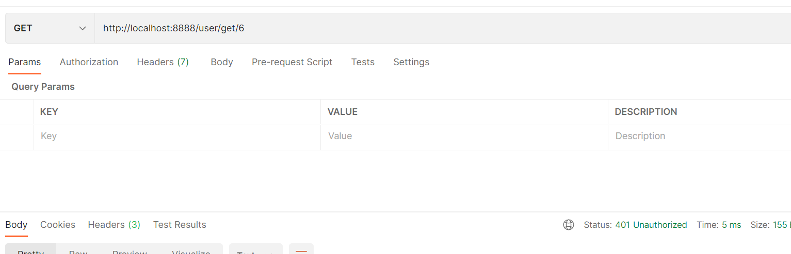
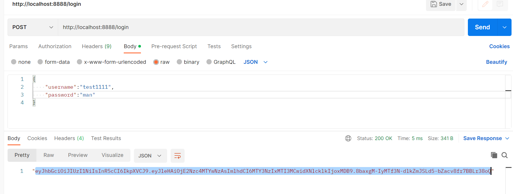
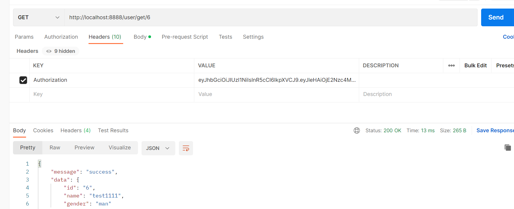
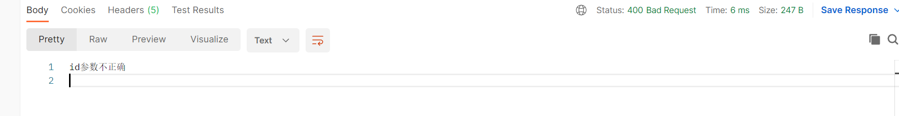

# 功能

## 1. jwt

jwt在目前登录，鉴权等场景应用非常广泛

jwt是加密的字符串，需要一个秘钥，并且可以通过设置过期时间来使jwt生成的token失效。

我们在userapi中进行演示

### 1.1 配置

~~~go
type Config struct {
	rest.RestConf
	UserRpc zrpc.RpcClientConf
	Auth    struct {
		AccessSecret string
		AccessExpire int64
	}
}
~~~

~~~yaml
Auth:
  AccessSecret: "!@#$#@asdasds"
  AccessExpire: 604800
~~~

### 1.2 实现

生成token：

~~~go
func (l *UserLogic) getToken(secretKey string, iat, seconds, userId int64) (string, error) {
	claims := make(jwt.MapClaims)
	claims["exp"] = iat + seconds
	claims["iat"] = iat
	claims["userId"] = userId
	token := jwt.New(jwt.SigningMethodHS256)
	token.Claims = claims
	return token.SignedString([]byte(secretKey))
}

~~~

在api文件

~~~shell
@server(
	jwt: Auth
)
service userapi-api {
	@handler UserapiHandler
	get /from/:name(Request) returns (Response)
}
~~~

生成

~~~shell
goctl api go -api userapi.api -dir ./gen
~~~

通过生成的代码，我们知道其是在RegisterHandlers注册路由时，在路由上加了jwt验证

~~~go
// Code generated by goctl. DO NOT EDIT.
package handler

import (
	"net/http"

	"userapi/internal/svc"

	"github.com/zeromicro/go-zero/rest"
)

func RegisterHandlers(server *rest.Server, serverCtx *svc.ServiceContext) {
	handler := NewUserHandler(serverCtx)
	server.AddRoutes(
		[]rest.Route{
			{
				Method:  http.MethodPost,
				Path:    "/register",
				Handler: handler.Register,
			},
			{
				Method:  http.MethodPost,
				Path:    "/login",
				Handler: handler.Login,
			},
		},
	)
	server.AddRoutes(
		[]rest.Route{
			{
				Method:  http.MethodGet,
				Path:    "/user/get/:id",
				Handler: handler.GetUser,
			},
		},
		rest.WithJwt(serverCtx.Config.Auth.AccessSecret),
	)
}

~~~

login：

~~~go
func (l *UserLogic) Login(t *types.LoginRequest) (string, error) {
	auth := l.svcCtx.Config.Auth
	return l.getToken(auth.AccessSecret, time.Now().Unix(), auth.AccessExpire, 100)
}

~~~

~~~go
func (l *UserLogic) GetUser(req *types.IdRequest) (*types.Response, error) {
	value := l.ctx.Value("userId")
	logx.Infof("get token content: %s \n ", value)
	userResponse, err := l.svcCtx.UserRpc.GetUser(context.Background(), &user.IdRequest{
		Id: req.Id,
	})
	if err != nil {
		return nil, err
	}
	return &types.Response{
		Message: "success",
		Data:    userResponse,
	}, nil
}
~~~

验证：

不加认证

加上认证

## 2. 中间件

### 2.1 路由中间件

~~~api
@server(
    jwt: Auth
    middleware: Example // 路由中间件声明
)
~~~

~~~shell
goctl api go -api userapi.api -dir ./gen
~~~

主要看一下其主要在哪生成的，知道应该在哪写中间件。

~~~go
package middlewares

import (
	"github.com/zeromicro/go-zero/core/logx"
	"net/http"
)

type UserMiddleware struct {
}

func NewUserMiddleware() *UserMiddleware {
	return &UserMiddleware{}
}

func (*UserMiddleware) RegAndLoginHandler(next http.HandlerFunc) http.HandlerFunc {
	return func(w http.ResponseWriter, r *http.Request) {
		logx.Info("login 和 register 前面执行")
		next(w, r)
		logx.Info("login 和 register 后面面执行")
	}
}

~~~

~~~go
package svc

import (
	"github.com/zeromicro/go-zero/zrpc"
	"user/userclient"
	"userapi/internal/config"
	"userapi/internal/middlewares"
)

type ServiceContext struct {
	Config         config.Config
	UserRpc        userclient.User
	UserMiddleware *middlewares.UserMiddleware
}

func NewServiceContext(c config.Config) *ServiceContext {
	return &ServiceContext{
		Config:         c,
		UserRpc:        userclient.NewUser(zrpc.MustNewClient(c.UserRpc)),
		UserMiddleware: middlewares.NewUserMiddleware(),
	}
}

~~~

~~~go
// Code generated by goctl. DO NOT EDIT.
package handler

import (
	"net/http"

	"userapi/internal/svc"

	"github.com/zeromicro/go-zero/rest"
)

func RegisterHandlers(server *rest.Server, serverCtx *svc.ServiceContext) {
	handler := NewUserHandler(serverCtx)
	server.AddRoutes(
		rest.WithMiddlewares(
			[]rest.Middleware{
				serverCtx.UserMiddleware.RegAndLoginHandler,
			},
			rest.Route{
					Method:  http.MethodPost,
					Path:    "/register",
					Handler: handler.Register,
			},
			rest.Route{
				Method:  http.MethodPost,
				Path:    "/login",
				Handler: handler.Login,
			},
	))
	server.AddRoutes(
		[]rest.Route{
			{
				Method:  http.MethodGet,
				Path:    "/user/get/:id",
				Handler: handler.GetUser,
			},
		},
		rest.WithJwt(serverCtx.Config.Auth.AccessSecret),
	)
}

~~~

### 2.2 全局中间件

~~~go
server.Use(serverCtx.UserMiddleware.GlobalHandler)
~~~

## 3. 自定义错误

之前：

~~~go
if req.Id == "1" {
		return nil, errors.New("id参数不正确")
	}
~~~

仅仅会返回简单的error信息

如果想要返回json格式的错误，在go-zero中如何做呢？

~~~go
package errorx

var ParamsError = New(1101001, "参数不正确")

type BizError struct {
	Code int    `json:"code"`
	Msg  string `json:"msg"`
}

type ErrorResponse struct {
	Code int    `json:"code"`
	Msg  string `json:"msg"`
}

func New(code int, msg string) *BizError {
	return &BizError{
		Code: code,
		Msg:  msg,
	}
}

func (e *BizError) Error() string {
	return e.Msg
}

func (e *BizError) Data() interface{} {
	return &ErrorResponse{
		e.Code,
		e.Msg,
	}
}

~~~

处理自定义错误

~~~go
httpx.SetErrorHandlerCtx(func(ctx context.Context, err error) (int, interface{}) {
		switch e := err.(type) {
		case *errorx.BizError:
			return http.StatusOK, e.Data()
		default:
			return http.StatusInternalServerError, nil
		}
	})
~~~

~~~go
if req.Id == "1" {
		return nil, errorx.ParamsError
	}
~~~

## 4. 修改模板

go-zero生成代码都是基于模板去生成的，如果生成的代码，不符合期望，你可以自行去修改模板代码

初始化模板

~~~shell
goctl template init
~~~

你会看到模板的地址

然后根据自己需求修改即可。

