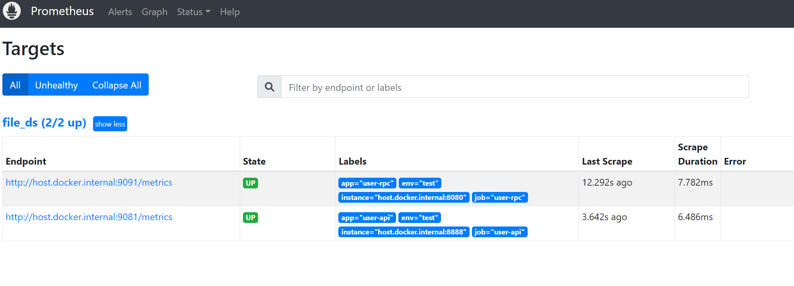

# 集成

## 1. 日志

在前面我们使用了go-zero的日志

~~~go
type Logger interface {
    // Error logs a message at error level.
    Error(...interface{})
    // Errorf logs a message at error level.
    Errorf(string, ...interface{})
    // Errorv logs a message at error level.
    Errorv(interface{})
    // Errorw logs a message at error level.
    Errorw(string, ...LogField)
    // Info logs a message at info level.
    Info(...interface{})
    // Infof logs a message at info level.
    Infof(string, ...interface{})
    // Infov logs a message at info level.
    Infov(interface{})
    // Infow logs a message at info level.
    Infow(string, ...LogField)
    // Slow logs a message at slow level.
    Slow(...interface{})
    // Slowf logs a message at slow level.
    Slowf(string, ...interface{})
    // Slowv logs a message at slow level.
    Slowv(interface{})
    // Sloww logs a message at slow level.
    Sloww(string, ...LogField)
    // WithContext returns a new logger with the given context.
    WithContext(context.Context) Logger
    // WithDuration returns a new logger with the given duration.
    WithDuration(time.Duration) Logger
}
~~~

在实际的使用中，记录日志可能更倾向于使用一些更成熟的库，比如zap

我们可以将zap做为go-zero的实现

~~~go
package zapx

import (
	"fmt"

	"github.com/zeromicro/go-zero/core/logx"
	"go.uber.org/zap"
)

const callerSkipOffset = 3

type ZapWriter struct {
	logger *zap.Logger
}

func NewZapWriter(opts ...zap.Option) (logx.Writer, error) {
	opts = append(opts, zap.AddCallerSkip(callerSkipOffset))
	logger, err := zap.NewProduction(opts...)
	if err != nil {
		return nil, err
	}

	return &ZapWriter{
		logger: logger,
	}, nil
}

func (w *ZapWriter) Alert(v interface{}) {
	w.logger.Error(fmt.Sprint(v))
}

func (w *ZapWriter) Close() error {
	return w.logger.Sync()
}

func (w *ZapWriter) Debug(v interface{}, fields ...logx.LogField) {
	w.logger.Debug(fmt.Sprint(v), toZapFields(fields...)...)
}

func (w *ZapWriter) Error(v interface{}, fields ...logx.LogField) {
	w.logger.Error(fmt.Sprint(v), toZapFields(fields...)...)
}

func (w *ZapWriter) Info(v interface{}, fields ...logx.LogField) {
	w.logger.Info(fmt.Sprint(v), toZapFields(fields...)...)
}

func (w *ZapWriter) Severe(v interface{}) {
	w.logger.Fatal(fmt.Sprint(v))
}

func (w *ZapWriter) Slow(v interface{}, fields ...logx.LogField) {
	w.logger.Warn(fmt.Sprint(v), toZapFields(fields...)...)
}

func (w *ZapWriter) Stack(v interface{}) {
	w.logger.Error(fmt.Sprint(v), zap.Stack("stack"))
}

func (w *ZapWriter) Stat(v interface{}, fields ...logx.LogField) {
	w.logger.Info(fmt.Sprint(v), toZapFields(fields...)...)
}

func toZapFields(fields ...logx.LogField) []zap.Field {
	zapFields := make([]zap.Field, 0, len(fields))
	for _, f := range fields {
		zapFields = append(zapFields, zap.Any(f.Key, f.Value))
	}
	return zapFields
}
~~~

应用：

~~~go
writer, err := zapx.NewZapWriter()
	logx.Must(err)
	logx.SetWriter(writer)
~~~

## 2. Prometheus

在微服务的开发当中，监控也是一件非常重要的事情，很多线上问题都需要通过监控来触发告警，从而进行及时处理。

Prometheus是目前应用最广，使用最多的监控中间件。

同样，我们先部署prometheus

~~~yaml
  prometheus:
    container_name: prometheus
    image: bitnami/prometheus:2.40.7
    environment:
      - TZ=Asia/Shanghai
    privileged: true
    volumes:
      - ${PRO_DIR}/prometheus.yml:/opt/bitnami/prometheus/conf/prometheus.yml  # 将 prometheus 配置文件挂载到容器里
      - ${PRO_DIR}/target.json:/opt/bitnami/prometheus/conf/targets.json  # 将 prometheus 配置文件挂载到容器里
    ports:
      - "9090:9090"                     # 设置容器9090端口映射指定宿主机端口，用于宿主机访问可视化web
    restart: always
~~~

prometheus.yml

~~~yaml
# my global config
global:
  scrape_interval: 15s # Set the scrape interval to every 15 seconds. Default is every 1 minute.
  evaluation_interval: 15s # Evaluate rules every 15 seconds. The default is every 1 minute.
  # scrape_timeout is set to the global default (10s).

# Alertmanager configuration
alerting:
  alertmanagers:
    - static_configs:
        - targets:
          # - alertmanager:9093

# Load rules once and periodically evaluate them according to the global 'evaluation_interval'.
rule_files:
# - "first_rules.yml"
# - "second_rules.yml"

# A scrape configuration containing exactly one endpoint to scrape:
# Here it's Prometheus itself.
scrape_configs:
  # The job name is added as a label `job=<job_name>` to any timeseries scraped from this config.
  - job_name: 'file_ds'
    file_sd_configs:
      - files:
          - targets.json
~~~

targets.json

~~~json
[
  {
    "targets": ["host.docker.internal:9081"],
    "labels": {
      "job": "user-api",
      "app": "user-api",
      "env": "test",
      "instance": "host.docker.internal:8888"
    }
  },
  {
    "targets": ["host.docker.internal:9091"],
    "labels": {
      "job": "user-rpc",
      "app": "user-rpc",
      "env": "test",
      "instance": "host.docker.internal:8080"
    }
  }
]
~~~

在userapi添加配置

~~~yaml
Prometheus:
  Host: 127.0.0.1
  Port: 9081
  Path: /metrics
~~~

在user模块添加配置

~~~yaml
Prometheus:
  Host: 127.0.0.1
  Port: 9091
  Path: /metrics
~~~

访问：http://localhost:9090/targets?search=

## 3. jaeger

jaeger是一个用于链路追踪的中间件。

同样，先安装jaeger

docker-compose.yaml

~~~yaml
  jaeger:
    container_name: jaeger
    image: rancher/jaegertracing-all-in-one:1.20.0
    environment:
      - TZ=Asia/Shanghai
      - SPAN_STORAGE_TYPE=elasticsearch
      - ES_SERVER_URLS=http://elasticsearch:9200
      - LOG_LEVEL=debug
    privileged: true
    ports:
      - "6831:6831/udp"
      - "6832:6832/udp"
      - "5778:5778"
      - "16686:16686"
      - "4317:4317"
      - "4318:4318"
      - "14250:14250"
      - "14268:14268"
      - "14269:14269"
      - "9411:9411"
    restart: always
  elasticsearch:
    container_name: elasticsearch
    image: elasticsearch:7.13.1
    environment:
      - TZ=Asia/Shanghai
      - discovery.type=single-node
      - "ES_JAVA_OPTS=-Xms512m -Xmx512m"
    privileged: true
    ports:
      - "9200:9200"
    restart: always
~~~

在之前的userapi和user模块中加入配置：

~~~yaml
Telemetry:
  Name: user-api
  Endpoint: http://localhost:14268/api/traces
  Sampler: 1.0
  Batcher: jaeger
~~~

~~~yaml
Telemetry:
  Name: user-rpc
  Endpoint: http://localhost:14268/api/traces
  Sampler: 1.0
  Batcher: jaeger
~~~

启动访问`http://localhost:16686/`进行测试。

## 4. 分布式事务

分布式事务也是微服务架构中必不可少的。

go-zero使用了dtm的方案来解决分布式事务问题，dtm也是国人开发。

dtm地址：https://www.dtm.pub/

集成地址：https://dtm.pub/ref/gozero.html

同样我们先安装dtm

下载dtm源码，可以挑选一个版本

~~~shell
git clone https://github.com/dtm-labs/dtm.git
~~~

然后将conf.sample.yml改名为conf.yml

放入以下内容：

~~~yaml
MicroService:
 Driver: 'dtm-driver-gozero' # name of the driver to handle register/discover
 Target: 'etcd://localhost:2379/dtmservice' # register dtm server to this url
 EndPoint: 'localhost:36790'
~~~

然后运行

~~~shell
go run main.go -c conf.yml
~~~

创建表：

~~~sql
create database if not exists dtm_barrier
/*!40100 DEFAULT CHARACTER SET utf8mb4 */
;
drop table if exists dtm_barrier.barrier;
create table if not exists dtm_barrier.barrier(
  id bigint(22) PRIMARY KEY AUTO_INCREMENT,
  trans_type varchar(45) default '',
  gid varchar(128) default '',
  branch_id varchar(128) default '',
  op varchar(45) default '',
  barrier_id varchar(45) default '',
  reason varchar(45) default '' comment 'the branch type who insert this record',
  create_time datetime DEFAULT now(),
  update_time datetime DEFAULT now(),
  key(create_time),
  key(update_time),
  UNIQUE key(gid, branch_id, op, barrier_id)
) ENGINE = InnoDB DEFAULT CHARSET = utf8mb4;
~~~

### 4.1 创建积分服务

假设我们这里有个业务，在注册的时候，需要给用户增加积分，这个积分可以后续在系统的商城进行兑换商品。

我们创建一个独立的积分服务，注册成功后，进行积分服务调用，增加积分，如果积分增加失败，回滚。

sql

~~~sql
CREATE TABLE `user_score`  (
  `id` bigint(0) NOT NULL AUTO_INCREMENT,
  `user_id` bigint(0) NOT NULL,
  `score` int(0) NOT NULL,
  PRIMARY KEY (`id`) USING BTREE
) ENGINE = InnoDB CHARACTER SET = utf8mb4 COLLATE = utf8mb4_general_ci ROW_FORMAT = Dynamic;
~~~

~~~go
go get github.com/dtm-labs/dtm
go get github.com/dtm-labs/driver-gozero
~~~

### 4.2 实现

api中初始逻辑：

~~~go
func (l *UserLogic) Register(req *types.Request) (resp *types.Response, err error) {
	userResponse, err := l.svcCtx.UserRpc.SaveUser(context.Background(), &user.UserRequest{
		Name:   req.Name,
		Gender: req.Gender,
	})
	if err != nil {
		return nil, err
	}
	userId, _ := strconv.ParseInt(userResponse.Id, 10, 64)
	scoreRequest := &userscore.UserScoreRequest{
		UserId: userId,
		Score:  10,
	}
	score, err := l.svcCtx.UserScoreRpc.SaveUserScore(context.Background(), scoreRequest)
	if err != nil {
		return nil, err
	}
	logx.Infof("register add score %d", score.Score)
	return &types.Response{
		Message: "success",
		Data:    userResponse,
	}, nil
}

~~~

当添加积分失败时，无法回滚，所以我们加入dtm事务。

~~~go
// 下面这行导入gozero的dtm驱动
import _ "github.com/dtm-labs/driver-gozero"
// dtm已经通过前面的配置，注册到下面这个地址，因此在dtmgrpc中使用该地址
var dtmServer = "etcd://localhost:2379/dtmservice"
~~~

~~~go

func (l *UserLogic) Register(req *types.Request) (resp *types.Response, err error) {
	gid := dtmgrpc.MustGenGid(dtmServer)
	//消息型
	msgGrpc := dtmgrpc.NewSagaGrpc(dtmServer, gid)
	userRequest := &user.UserRequest{
		Name:   req.Name,
		Gender: req.Gender,
	}
	userServer, err := l.svcCtx.Config.UserRpc.BuildTarget()
	if err != nil {
		return nil, err
	}
	userScoreServer, err := l.svcCtx.Config.UserScoreRpc.BuildTarget()
	if err != nil {
		return nil, err
	}
	msgGrpc.Add(userServer+"/user.User/saveUser", userServer+"/user.User/saveUserCallback", userRequest)
	//userResponse, err := l.svcCtx.UserRpc.SaveUser(context.Background(), userRequest)
	//if err != nil {
	//	return nil, err
	//}
	//userId, _ := strconv.ParseInt(userResponse.Id, 10, 64)
	scoreRequest := &userscore.UserScoreRequest{
		UserId: 100,
		Score:  10,
	}
	msgGrpc.Add(userScoreServer+"/userscore.UserScore/saveUserScore", "", scoreRequest)
	//score, err := l.svcCtx.UserScoreRpc.SaveUserScore(context.Background(), scoreRequest)
	//if err != nil {
	//	return nil, err
	//}
	msgGrpc.WaitResult = true
	err = msgGrpc.Submit()
	if err != nil {
		fmt.Println("-----------------------")
		fmt.Println(err)
		return nil, errors.New(err.Error())
	}
	//logx.Infof("register add score %d", score.Score)
	return &types.Response{
		Message: "success",
		Data:    "",
	}, nil
}
~~~

~~~go

func (l *GetUserLogic) SaveUser(in *user.UserRequest) (*user.UserResponse, error) {
	// todo: add your logic here and delete this line
	fmt.Println("------------------start-----------------")
	barrier, err := dtmgrpc.BarrierFromGrpc(l.ctx)
	if err != nil {
		return nil, err
	}
	data := &model.User{
		Name:   in.GetName(),
		Gender: in.GetGender(),
	}
	err = barrier.CallWithDB(l.svcCtx.Db, func(tx *sql.Tx) error {
		err := l.svcCtx.UserRepo.Save(context.Background(), tx, data)
		return err
	})
	if err != nil {
		fmt.Println(err)
		//Internal重试，Aborted 回滚
		return nil, status.Error(codes.Aborted, dtmcli.ResultFailure)
	}
	return &user.UserResponse{
		Id:     strconv.FormatInt(data.Id, 10),
		Name:   data.Name,
		Gender: data.Gender,
	}, nil
}
~~~

~~~go
func (l *GetUserLogic) SaveUserCallback(in *user.UserRequest) (*user.UserResponse, error) {
	fmt.Println("call back..........")
	return &user.UserResponse{}, nil
}
~~~

